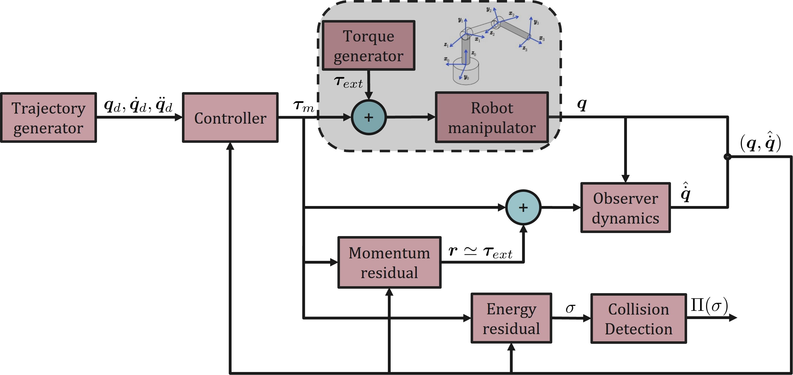

# Collision Detection Energy Residual
In this work we tackle the issue of collision detection, a key topic in the context of safe physical human-robot interaction. The problem is addressed in case of rigid robots via a scalar monitoring signal of the kinetic energy of the system. The proposed solution relies on proprioceptive sensors only and assumes that only the robot joint positions are available, while the velocities are estimated using a reduced-order observer.

## Energy-based residual
It is a scalar residual defined as
```math
        \sigma(t)=k_{\sigma} \left( \hat{T}(t)-\int_0^t{(\dot{\mathbf{q}}^T(\mathbf{\tau}_m-\hat{\mathbf{g}}(\mathbf{q}))+\sigma)ds}-\hat{T}(0) \right)
```
where $\hat{T}(t)$ is the estimate of the robot kinetic energy at instant $t\geq0$, $\hat{\mathbf{g}}(\mathbf{q})$ is the estimate of the gravity vector. In ideal condition its dynamics is
```math
        \dot{\sigma}(t)=k_{\sigma}\left( P_{ext}-\sigma \right)
```
where $P_{ext}=\dot{\mathbf{q}}^T\mathbf{\tau}_{ext}$ is the external power.

## Momentum-based residual
The vectorial residual signal is defined as
```math
        \mathbf{r}(t)=\ \mathbf{K}_r \left( \hat{\mathbf{p}}(t)-\int_0^t (\mathbf{\tau}_m-\hat{\mathbf{\beta}}(\mathbf{q},\dot{\mathbf{q}})+\mathbf{r})ds - \mathbf{p}(0) \right)
```
where $\mathbf{\beta}(\mathbf{q},\dot{\mathbf{q}}) \coloneqq \mathbf{g}(\mathbf{q})-\mathbf{C}^T(\mathbf{q},\dot{\mathbf{q}})\dot{\mathbf{q}}$ and $\hat{\mathbf{p}}(t)=\hat{\mathbf{M}}(\mathbf{q})\mathbf{\dot{q}}$.
Assuming ideal conditions, the dynamics is
```math
        \dot{\mathbf{r}}(t)=\mathbf{K}_r(\mathbf{\tau}_{ext}-\mathbf{r}(t)) \ ,
```
so it will be used as a virtual sensor of the torque generated in a collision.

## Reduced-order observer
Assumin $\dot{\mathbf{q}}$ not available for measurement, we detail a reduced-order observer following "[Andrea Cristofaro and Alessandro De Luca. Reduced-order observer design
for robot manipulators](https://ieeexplore.ieee.org/document/9849836)".

## Overall block scheme
The experiments are performed following the scheme - also in `media/block_scheme.jpg`



Further details on the components of the scheme are available in `report.pdf`.

## Simulations
The simulations carried out compare:
* reduced-order velocity observer vs numerical differentiation method, in two scenarios:
	- ideal case
	- model uncertainties (link masses increased of 5%)
* stiff controller vs compliant controller.

The following video - also in `media/video.mp4` file - shows the obtained results for the second comparison


https://github.com/gianni0907/Collision_Detection_Energy_Residual/assets/72451400/8653ded3-b0b4-4260-8960-5c79b2acaa78


Further details are available in the report.
